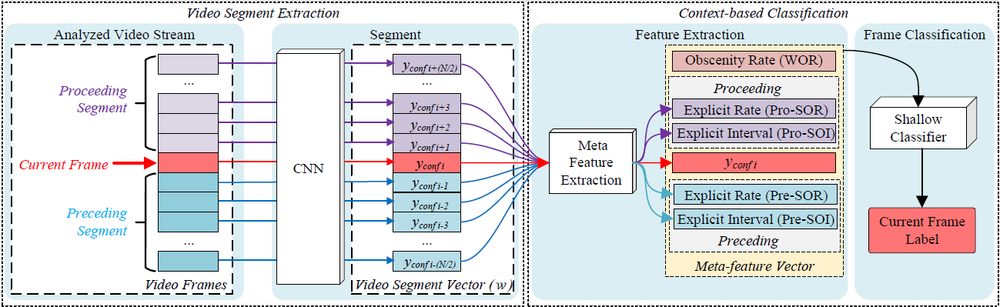

# Context-aware Model for Lightweight Real-time Detection of Obscene Videos
## Authors: Jhonatan Geremias and Eduardo K. Viegas and Altair O. Santin and Alceu Britto
The widespread availability of pornographic videos on social media platforms can harm young and unsuspecting individuals. Current detection approaches are ill-suited for real-time operations. Besides disregarding pornographic context shifts in the analyzed video, such as an individual removing his clothes, researchers also escalate system complexity to enhance accuracy, making them unsuitable for devices with limited resources. This paper introduces a lightweight and real-time context-aware model for detecting obscene videos, implemented in two phases. First, context is acquired by applying an image-based CNN to compound a video segment vector. Our insight lies in extracting the video frame context according to the classification outputs that preceded and proceeded with the analyzed frame. Secondly, the model extracts high-level contextual features by analyzing the frames surrounding the video frame under consideration. As a result, it achieves real-time operation without substantial processing demands while considering the contextual information of the video frames. Experiments with over 470 thousand labeled video frames revealed that current methods decrease their true-positive rate by up to 0.24 in the presence of pornographic video shifts. In addition, our proposed model can improve the true-positive rates by up to 0.32 while incurring an average reduction of only 1% on detection throughput.

## Proposal

